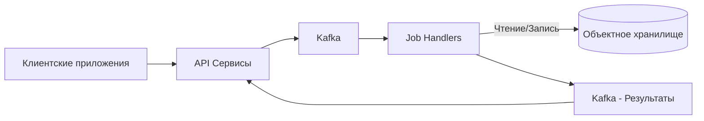
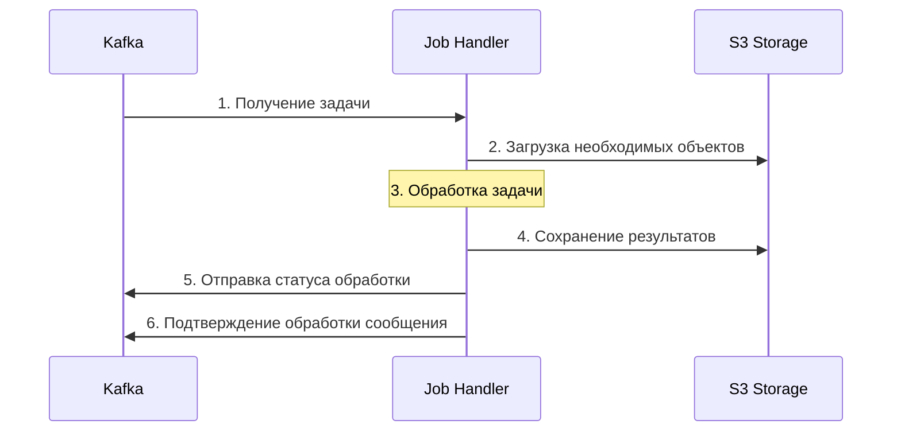

# Selfix Jobs

## Обзор

Это репозиторий для проекта обработчиков задач (job handlers) Selfix, отвечающих за:

- [Создание ИИ аватаров](Selfix.Jobs/Selfix.Jobs.AvatarCreator/AvatarCreator.md)
- [Генерацию изображений](Selfix.Jobs/Selfix.Jobs.ImageGenerator/ImageGenerator.md)
- И другие ML/AI задачи

## Архитектура

Обработчики задач интегрируются с остальными компонентами системы через Kafka и объектное хранилище (S3-совместимое).

## Процесс обработки задачи

## Детали процесса

1. **Получение задач**: Обработчики подписываются на соответствующие топики Kafka и получают задачи на обработку
2. **Получение данных**: Загрузка необходимых файлов и метаданных из S3-совместимого хранилища
3. **Обработка**: Применение алгоритмов ИИ/МЛ для выполнения задачи
4. **Сохранение результата**: Запись обработанных данных обратно в объектное хранилище
5. **Уведомление о результате**: Отправка сообщения с информацией о результате в соответствующий топик Kafka
6. **Подтверждение обработки**: Сигнал для удаления обработанного сообщения из входного топика

## Компоненты инфраструктуры

### Kafka интеграция

- **Потребители** (Consumers): компоненты для получения задач из входных топиков
- **Производители** (Producers): сервисы для отправки результатов обработки в выходные топики
- **Группы потребителей**: организация обработчиков для масштабирования и отказоустойчивости

### Объектное хранилище

Абстракция над S3-совместимым хранилищем для:

- Загрузки входных данных
- Сохранения результатов обработки
- Хранения промежуточных состояний
- Кеширования часто используемых объектов

## Запуск и развертывание

Для информации о запуске и развертывании системы обработчиков см. [документацию по инфраструктуре](/home/stan/AvatarAI/selfix-infrastructure-docs/).
