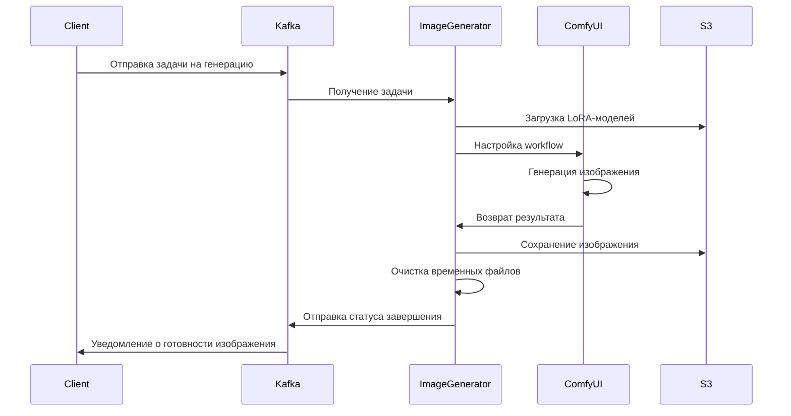

# Selfix Image Generator

## Обзор

Selfix Image Generator - это система для генерации изображений с использованием предобученных ИИ-моделей. Сервис
обрабатывает запросы из очереди Kafka, применяет указанные LoRA-модели с помощью ComfyUI и сохраняет результаты в
S3-совместимое хранилище.

## Архитектура

### Компоненты системы

1. **Обработчик задач (.NET)** - основной сервис, который:

    - Получает задания из Kafka
    - Загружает необходимые LoRA-модели из S3
    - Взаимодействует с ComfyUI через API
    - Отправляет результаты обратно в Kafka
    - Очищает временные файлы после обработки

2. **ComfyUI** - графический интерфейс для создания и выполнения генеративных workflows:

    - Запускается как локальный сервис внутри контейнера
    - Использует предустановленные кастомные ноды
    - Выполняет workflows, отправленные через API
    - Обрабатывает запросы с использованием GPU

3. **Модели и данные**:
    - Модель FLUX со всем необходимым внутри предназначенная для ComfyUI
    - LoRA-адаптеры для персонализации
    - Контрольные ноды (ControlNet)
    - Шаблоны workflows для разных типов генерации

### Технологический стек

- **Языки программирования**: C# (.NET), Python
- **ML-фреймворки**: PyTorch, ComfyUI
- **Инфраструктура**: Docker, NVIDIA CUDA
- **Интеграции**: Kafka, S3-совместимое хранилище

## Процесс обработки задач



## Взаимодействие с ComfyUI

### API интерфейс

Система взаимодействует с ComfyUI через его API интерфейс:

1. **WebSocket-соединение** для отслеживания событий:

   ```
   ws://localhost:8188/ws?clientId={clientId}
   ```

2. **HTTP API** для отправки workflow:
   ```
   POST http://localhost:8188/prompt
   ```

### Процесс выполнения workflow

1. Установление WebSocket-соединения с ComfyUI
2. Подготовка workflow с входными параметрами
3. Отправка workflow через HTTP API
4. Получение уведомлений о ходе выполнения через WebSocket
5. Обработка результатов после завершения

### Пример кода взаимодействия с ComfyUI

```csharp
public async Task<WorkflowResponse> Generate(WorkflowPromptRequest request)
{
    var cancellationTokenSource = new CancellationTokenSource();

    // Подключение к WebSocket
    using var client = new WebsocketClient(new Uri($"ws://localhost:8188/ws?clientId={_clientId}"));
    client.MessageReceived.Subscribe(msg => HandleComfyUIMessage(msg.Text));
    await client.Start();

    // Отправка workflow в ComfyUI
    var content = new StringContent(JsonSerializer.Serialize(request));
    var response = await _httpClient.PostAsync("/prompt", content);
    response.EnsureSuccessStatusCode();

    // Ожидание завершения
    while (!_workflowComplete && !cancellationTokenSource.Token.IsCancellationRequested)
    {
        await Task.Delay(100, cancellationTokenSource.Token);
    }

    // Обработка и возврат результата
    return _currentWorkflowResponse;
}
```

## Развёртывание и запуск

### Требования к системе

- NVIDIA GPU с поддержкой CUDA
- Docker и Docker Compose
- Доступ к сервисам Kafka и S3

### Docker конфигурация

Система развертывается в Docker-контейнере с использованием образа на базе CUDA:

1. **Образ**: nvidia/cuda:12.4.1-base-ubuntu22.04
2. **Основные компоненты**:

    - .NET 9.0 Runtime и SDK
    - Python 3 с PyTorch (CUDA-совместимый)
    - ComfyUI с кастомными нодами
    - Скрипты управления процессом генерации

3. **Переменные окружения для интеграции**:
    - Kafka:
        - `KAFKA_BOOTSTRAP_SERVER`: Адрес Kafka
        - `KAFKA_SECURITY_PROTOCOL`: Протокол безопасности
        - `KAFKA_SASL_MECHANISM`: Механизм аутентификации
        - `KAFKA_SASL_USERNAME`: Имя пользователя
        - `KAFKA_SASL_PASSWORD`: Пароль
        - `KAFKA_GROUP_ID`: ID группы потребителей
        - `KAFKA_TOPIC_INPUT`: Имя входного топика
        - `KAFKA_TOPIC_OUTPUT`: Имя выходного топика
    - S3:
        - `S3_ENDPOINT`: Адрес S3-хранилища
        - `S3_ACCESS_KEY`: Ключ доступа
        - `S3_SECRET_KEY`: Секретный ключ
        - `S3_REGION`: Регион
        - `S3_BUCKET`: Имя бакета
        - `S3_USE_SSL`: Использование SSL
    - ComfyUI:
        - `COMFY_PORT`: Порт для ComfyUI (по умолчанию 8188)
        - `COMFY_HOST`: Хост для ComfyUI (по умолчанию localhost)
        - `MODELS_DIR`: Директория с моделями
        - `TEMP_DIR`: Директория для временных файлов

### Запуск через Docker Compose

```bash
docker compose up -d
```

### Структура томов

- **/app/models**: Директория с базовыми моделями
    - /app/models/checkpoints: Checkpoint-модели (FLUX1.dev for ComfyUI)
    - /app/models/loras: LoRA-модели
- **/app/temp**: Директория для временных файлов

## Интеграция

### Топики Kafka

Сервис использует следующие топики Kafka:

1. **Входные топики**:

    - `${KAFKA_TOPIC_INPUT}`: Входящие задачи на генерацию изображений

2. **Выходные топики**:
    - `${KAFKA_TOPIC_OUTPUT}`: Результаты генерации изображений

### Формат сообщений

**Входящее сообщение для генерации изображения**:

```json
{
  "taskId": "uuid-task-identifier",
  "userId": "user-identifier",
  "workflow": {}, // workflow to send to comfyui
  "loraModel": "users/user-id/models/avatar-model.safetensors",
  "priority": 1
}
```

**Исходящее сообщение с результатом**:

```json
{
  "taskId": "uuid-task-identifier",
  "userId": "user-identifier",
  "status": "completed",
  "imagePath": "users/user-id/images/generated-image-1.png",
  "metadata": {
    "generationTime": 12.5
  }
}
```

## Управление ресурсами

### Очистка временных файлов

После каждой генерации выполняется очистка временных файлов для предотвращения заполнения диска:

```csharp
private async Task CleanupTemporaryFiles(string taskId)
{
    try
    {
        var taskDir = Path.Combine(_tempDir, taskId);
        if (Directory.Exists(taskDir))
        {
            Directory.Delete(taskDir, true);
        }

        // Отправка запроса на очистку кэша ComfyUI
        await _httpClient.PostAsync("/cleanup", null);
    }
    catch (Exception ex)
    {
        _logger.LogError(ex, "Failed to cleanup temporary files for task {TaskId}", taskId);
    }
}
```

### Освобождение памяти GPU

Для предотвращения утечек памяти на GPU предусмотрен механизм периодической очистки:

1. Периодический вызов эндпоинта `/gpu/reset` в ComfyUI
2. Мониторинг использования памяти GPU
3. Перезапуск ComfyUI при достижении пороговых значений

## Подключение кастомных нод в ComfyUI

ComfyUI настроен на использование следующих кастомных нод:

1. **ComfyUI-Manager**: Управление нодами и расширениями
2. **ComfyUI-Impact-Pack**: Расширенные возможности обработки изображений
3. **Efficiency Nodes**: Оптимизация использования ресурсов
4. **ControlNet nodes**: Работа с ControlNet

## Исходные файлы

- **Dockerfile**: Определяет окружение для .NET, Python и ComfyUI
- **compose.yml**: Конфигурация Docker Compose с настройками GPU и томов
- **entrypoint.sh**: Скрипт запуска ComfyUI и .NET приложения
- **Selfix.ImageGenerator.csproj**: Проект .NET обработчика задач

## Мониторинг и логирование

- Логи ComfyUI доступны в `/app/comfylogs`
- Логи .NET приложения через стандартный вывод контейнера
- Метрики использования GPU через Prometheus экспортер

### Пример настройки через docker-compose

```yaml
image-generator:
  build:
    context: .
    dockerfile: Dockerfile
  image: image-generator
  container_name: image-generator
  environment:
    - KAFKA_BOOTSTRAP_SERVER=kafka:9092
    - KAFKA_GROUP_ID=image-generator-group
    - KAFKA_TOPIC_INPUT=image-generation-jobs
    - KAFKA_TOPIC_OUTPUT=image-generation-results
    - S3_ENDPOINT=minio:9000
    - S3_ACCESS_KEY=minioadmin
    - S3_SECRET_KEY=minioadmin
    - S3_BUCKET=images-data
    - MODELS_DIR=/models
  volumes:
    - /home/stan/selfix/ml/models:/models:ro
  deploy:
    resources:
      reservations:
        devices:
          - driver: nvidia
            count: all
            capabilities: [gpu]
  restart: unless-stopped
```

---

_Документация составлена для внутреннего использования команды Selfix_
